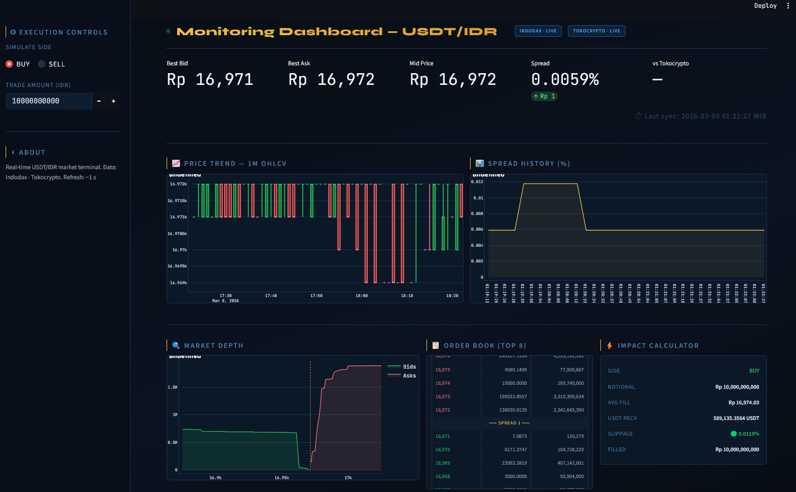
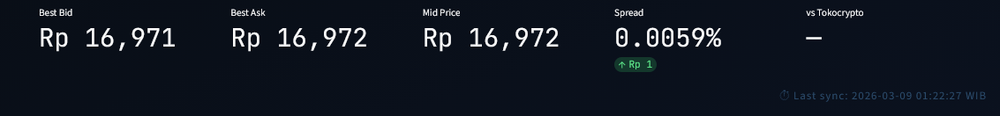
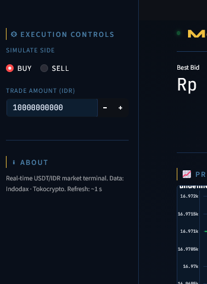
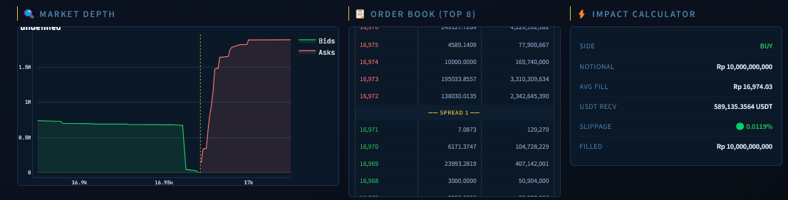
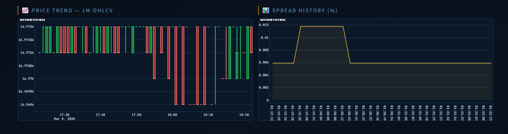

# USDT-IDR Market Monitor: A Demo
A high-fidelity monitoring terminal for the USDT/IDR pair, built for liquidity analysis and execution simulation across Indonesian exchanges. This project focuses on minimizing latency and maximizing the visibility of order book depth through a "Terminal-as-a-Service" UI. 

## 1. Context & Business Case
### Background: The Liquidity Challenge
In the Indonesian crypto ecosystem, the **USDT/IDR** pair serves as the foundational gateway for digital asset trading. For a Business Operations team, the "ticker price" is often a surface-level metric. The real operational challenge lies in **Liquidity Depth**. 

When a market is "thin" (low density of orders in the book), even a moderate trade can cause the price to move unfavorably. This phenomenon, known as **Slippage**, directly increases the cost of doing business and negatively impacts user experience.

### Case Study: The "Invisible" Cost of Execution
Imagine a scenario where a Business Operations Associate must execute a **100,000,000 IDR** sell order to rebalance company liquidity:
* **The Ticker Price:** 16,971 IDR.
* **The Problem:** There isn't enough immediate demand at 16,971 to fill the entire 100M IDR order.
* **The Reality:** To complete the sale, the order "walks" down the order book, filling at progressively lower prices.
* **The Goal:** This dashboard was built to predict this exact cost *before* the trade is executed, allowing for smarter, data-driven execution strategies.

  

---

## 2. What This Project Accomplishes
This dashboard is a high-frequency monitoring tool that transforms raw exchange data into three actionable operational insights:
1.  **Slippage Prediction:** Calculates the Volume Weighted Average Price (VWAP) for any specific trade size in real-time.
2.  **Liquidity Visualization:** Provides a cumulative view of "Market Walls" to identify where buyers and sellers are concentrated.
3.  **Spread Health:** Monitors the gap between Bid and Ask to identify periods of market stress or inefficiency.

---

## 3. Instruction Manual: How to Use the Dashboard

### Step 1: Real-Time Market Health
The top row of the dashboard displays the **Pulse of the Market**:
* **Best Bid/Ask:** The current highest buy and lowest sell prices available on the exchange.
* **Spread (%):** A critical health metric. A widening spread indicates a volatile or illiquid market where trading becomes expensive.

  

### Step 2: Running an Execution Simulation
The **Execution Simulation** panel on the left allows you to act as an Ops Manager or Institutional Trader:
1.  **Select Side:** Choose **Buy** or **Sell**.
2.  **Trade Amount:** Input your target volume in IDR (e.g., 500,000,000).
3.  **Analyze Impact:** The dashboard instantly calculates the **Execution VWAP** and **Est. Slippage**. 
    * *Operational Tip:* If slippage exceeds 0.2%, an Ops Manager might choose to split the order into smaller "slices" or wait for a period of higher liquidity.

  

### Step 3: Reading the Depth Chart
The **Market Depth Chart** (Green and Red areas) visualizes the future of price movement:
* **The Green Area (Bids):** Represents the "Floor." A steep green mountain indicates strong buy support; the price is unlikely to drop quickly.
* **The Red Area (Asks):** Represents the "Ceiling." A tall red mountain indicates heavy selling pressure.
* **The Mid-Point:** The narrow gap between these areas is where the spread exists.

  

### Step 4: Tracking Trends
The **Price History** and **Spread History** charts help identify correlation. For example, if the spread widens during a price drop, it indicates that liquidity is being pulled from the book, signaling a "Flash Crash" risk.

  

---

## 4. Technical Specifications & Architecture

### Data Sourcing
* **Engine:** Powered by the **CCXT** library for robust API communication with Indodax/Tokocrypto.
* **Update Frequency:** The dashboard utilizes a **1Hz (1 second)** refresh rate to ensure order book data reflects the current market heartbeat.

### Mathematical Logic: Slippage Calculation
The dashboard iterates through the Limit Order Book (LOB) to find the true execution price based on volume:

$$VWAP = \frac{\sum (Price_{level} \times Quantity_{filled})}{\text{Total Quantity}}$$

$$Slippage \% = \left| \frac{VWAP - BestPrice}{BestPrice} \right| \times 100$$

### Technical Stack
* **Python 3.10+**
* **Streamlit:** For high-performance, real-time UI/UX.
* **Plotly:** For interactive, financial-grade charting.
* **Pandas:** For real-time data frame manipulation and cumulative liquidity calculations.

---

## 5. How to Run Locally
1. Clone the repository: `git clone https://github.com/handiko/USDT-IDR-Monitoring-Dashboard`
2. Install dependencies: `pip install streamlit ccxt plotly pandas`
3. From the python folder, launch the application: `streamlit run app.py`

---

Back to [Algo Page](https://handiko.github.io/algo/)
